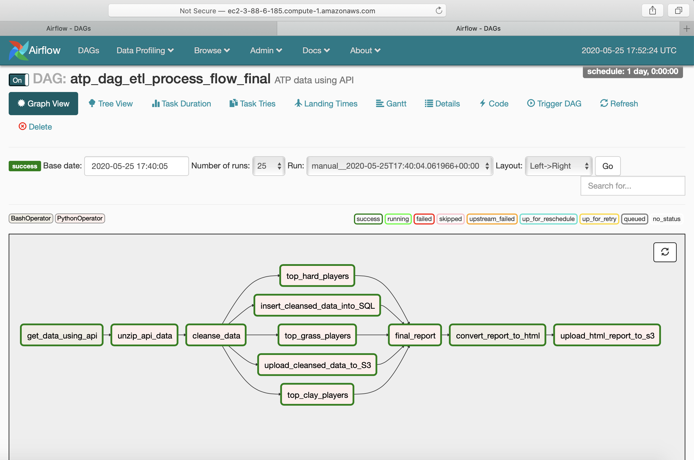

# Tennis Data Pipeline Project



### Project Description:
This project demonstrates the use of various technologies, like Airflow, DAGs, Papermill, Pandas, Jupyter Notebook, MySql or postgreSQL  db, and AWS S3,  to build an end to end data pipeline for extracting data using API and then processing the data in the pipeline by using Papermill and Jupyter notebook. The final output is uploaded on AWS S3 bucket. The pipeline can be  scheduled and run on a regular basis.

### Use Case:
I took ATP mens’ tour tennis data for this project and analyzed who are the best players on different surfaces like Clay, Grass and Hard surface.

[Tableau - Tennis Dashboard](https://public.tableau.com/profile/preeti.sehgal#!/vizhome/TennisDashboard1/Dashboard1?publish=yes)

### How it works:
 - First use BashOperator to call the api for downloading the required ATP men’s tour tennis data. This data will be in the form of a zipped file. 
 - Unzip the file and convert into pandas dataframe
 - Cleanse the data using pandas to delete unwanted data and create a csv file of cleansed data for further processing
 - Upload the cleansed data file on AWS S3 using boto3 and also 
 - Insert the data in a sql db using sqlalchemy. This can be MySql or PostreSQL db. Use the appropriate driver based on your sql db
 - Use papermill to call jupyter notebooks to aggregate the data for each surface type - clay, grass and hard surface and find hte best players on each surface
 - Generate a report using aggregated data
 - Convert the final report into an html file
 - Upload the html file on AWS S3 bucket

### Issues faced and remediation:
#### Issue : 
The papermill operator was throwing errors when I tried to run a jupyter notebook from an airflow dag. 
#### Remediation: 
Instead of using Papermill Operator to call Jupyter Notebook, I used python operator to call Jupyter notebook using Papermill.
Here’s an example of the python code that can be used to call jupyter notebook from Airflow using Papermill
```angular2
def call_jupyter():
    pm.execute_notebook(
        <input_notebook>,
        <output_notebook>,
        parameters={
                    'parameter1': variable1,
                    'parameter2': variable2,
                    }
    )

task = PythonOperator(
        task_id='call_jupyter_notebook',
        provide_context=False,
        python_callable=call_jupyter,
        dag=dag,
)

```

####Issue: 
Parameters had to be hardcoded in the code making it difficult to make it work on another machine or AWS EC2.
####Remediation:
I created a json file with all the variables and passwords and uploaded this file in Airflow Variables. The I called the variables in my DAG program and replaced all hard coding with these variables.
Now my code can run on any machine without changing the code. All I have to do is change the variables in the json file. Here's an example of how to call jason variables in your code.

```angular2html
######################
#   Read Variables
######################

var_list = Variable.get("tennis_atp_variables", deserialize_json=True)

var_api_cmd = var_list["var_api_cmd"]
var_atp_report_cmd = var_list["var_atp_report_cmd"]
var_path_unzip_from = var_list["var_path_unzip_from"]

```

###Tools used:
 - Airflow
 - Pandas
 - Papermill
 - Jupyter Notebook
 - MySql
 - postgreSQL
 - sqlalchemy
 - AWS S3
